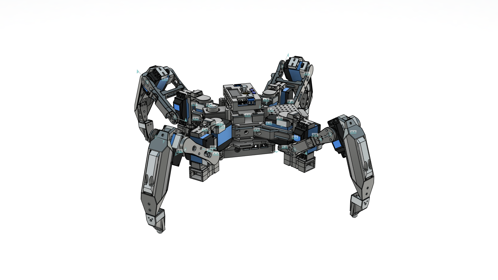
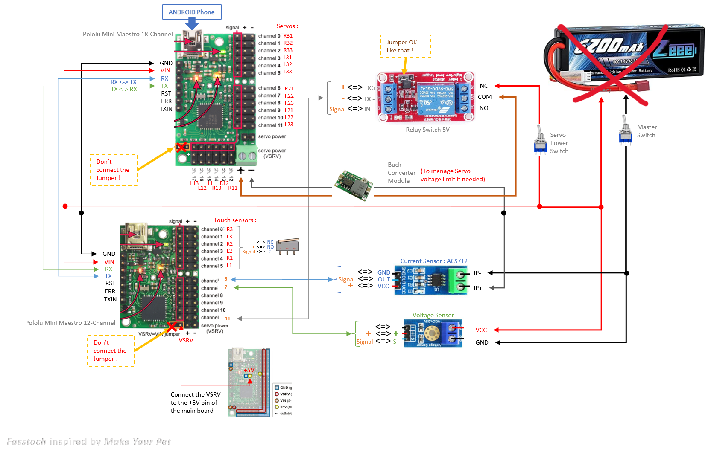

# Crawling Robot

## Components Cost Table

| No. | Name | Full Name | Quantity | Price/Unit (RM) | Link | Total Price (RM) |
|-----|------|-----------|----------|-----------------|------|------------------|
| 1 | Current Sensors | Hall Current Sensor Module ACS712 | 2 | 3.47 | [🔗](https://shopee.com.my/Hall-Current-Sensor-Module-ACS712-module-5A-20A-30A-Hall-Current-Sensor-Module-5A-20A-30A-ACS712-i.299149454.8768341881) | 6.94 |
| 2 | Voltage Sensors | Voltage Sensor Module For Arduino, Robotic | 2 | 1.41 | [🔗](https://shopee.com.my/Voltage-Sensor-Module-For-Arduino-Robotic-i.6674515.7111387321) | 2.82 |
| 3 | Servo | MG996 Steering Gear MG996R Servo Metal Gear | 12 | 21.81 | [🔗](https://shopee.com.my/product/604942619/45556758343) | 261.72 |
| 4 | On / Off Switch | Mini Toggle Switch SPST | 1 | 10.96 | [🔗](https://shopee.com.my/-HOT-SALE-10pcs-MTS-101-2-Pin-SPST-ON-OFF-2-Position-6A-250V-AC-for-Mini-for-Toggle-Switches-Kit-i.467495259.58054587486) | 10.96 |
| 5 | 2 Board Servo Controller | Pololu Maestro 18-Channel & 12-channel Servo Controller | 1 | 348.12 | [🔗]([https://example.com](https://www.pololu.com/product/1354)) | 348.12 |
| 7 | Connector | Deans Connector (Battery & Switches) | 5 | 8.00 | [🔗](https://example.com) | 40.00 |
| 8 | Limit Switch | Micro Limit Switch SPDT Rocker | 6 | 5.00 | [🔗](https://example.com) | 30.00 |
| 9 | Protection | Rubber End Caps | 6 | 4.00 | [🔗](https://example.com) | 24.00 |
| 10 | Mechanical | Stainless Steel Dowel Pins | 6 | 6.00 | [🔗](https://example.com) | 36.00 |
| 11 | Screws | M1.6 Screws Set | 120 | 0.10 | [🔗](https://example.com) | 12.00 |
| 12 | Screws | M2.5 Screws Set | 4 | 2.50 | [🔗](https://example.com) | 10.00 |
| 13 | Cable | USB-C to Mini USB Cable | 1 | 12.00 | [🔗](https://example.com) | 12.00 |
| 14 | Tester | Servo Tester | 1 | 25.00 | [🔗](https://example.com) | 25.00 |
| 15 | Adhesive | Super Glue | 1 | 8.00 | [🔗](https://example.com) | 8.00 |
| 16 | Wiring | Jumper Wires (Male-Female) | 4 | 6.00 | [🔗](https://example.com) | 24.00 |
| 17 | Relay | 5V Relay Module | 1 | 15.00 | [🔗](https://example.com) | 15.00 |
| 17 | Voltage Regulator | LM2596 DC DC Step Down Converter Voltage Regulator LED Display Voltmeter 4.0~40 to 1.3-37V Buck Adapter Adjustable Power Supply | 1 | 6.27 | [🔗]([https://example.com](https://shopee.com.my/LM2596-DC-DC-Step-Down-Converter-Voltage-Regulator-LED-Display-Voltmeter-4.0~40-to-1.3-37V-Buck-Adapter-Adjustable-Power-Supply-i.395116701.24905858490?extraParams=%7B%22display_model_id%22%3A204847014514%2C%22model_selection_logic%22%3A3%7D&sp_atk=81e042a3-9315-4f05-9915-3351c4e2dffa&xptdk=81e042a3-9315-4f05-9915-3351c4e2dffa)) | 6.27 |

---
## Reference project
https://github.com/almelnz2005/hexapod/tree/main
---

## 💰 Cost Summary

| Description | Amount (RM) |
|------------|------------|
| Subtotal | 872.83 |
| Additional Cost (Shipping/Tax) | 0.00 |
| **Total Cost** | **872.83** |

