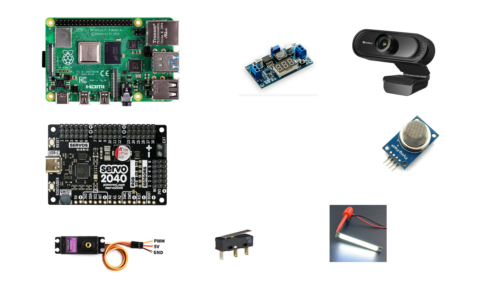

# Crawling Robot

## Components Cost Table

| No. | Name | Full Name | Quantity | Price/Unit (RM) | Link | Total Price (RM) |
|-----|------|-----------|----------|-----------------|------|------------------|
| 3 | Servo | MG996 Steering Gear MG996R Servo Metal Gear | 12 | - | [🔗]([https://shopee.com.my/product/604942619/45556758343](https://my.shp.ee/RkXWawVx)) | 161.89 |
| 4 | On / Off Switch | Mini Toggle Switch SPST | 1 | ❌ | [🔗](https://shopee.com.my/-HOT-SALE-10pcs-MTS-101-2-Pin-SPST-ON-OFF-2-Position-6A-250V-AC-for-Mini-for-Toggle-Switches-Kit-i.467495259.58054587486) | ❌ |
| 5 | Servo Controller | 18-Channel Servo Controller | 1 | - | [🔗]([https://example.com](https://www.pololu.com/product/1354)) | - |
| 8 | Limit Switch | Micro Limit Switch SPDT Rocker | 4 | ❌ | [🔗](https://example.com) | ❌ |
| 9 | Protection | Rubber End Caps | 4 | ❌ | [🔗](https://example.com) | ❌ |
| 10 | Mechanical | Stainless Steel Dowel Pins | 4 | ❌ | [🔗](https://example.com) | ❌ |
| 11 | Screws | M1.6 Screws Set | 120 | ❌ | [🔗](https://example.com) | ❌ |
| 12 | Screws | M2.5 Screws Set | 4 | ❌ | [🔗](https://example.com) | ❌ |
| 14 | Tester | Servo Tester | 1 | ❌ | [🔗](https://example.com) | ❌ |
| 14 | Power Supply | 12V 3A DC Power Supply | 1 | ❌ | [🔗](https://example.com) | ❌ |
| 17 | Voltage Regulator | LM2596 DC DC Step Down Converter Voltage Regulator LED Display Voltmeter 4.0~40 to 1.3-37V Buck Adapter Adjustable Power Supply | 1 | ❌ | [🔗]([https://example.com](https://shopee.com.my/LM2596-DC-DC-Step-Down-Converter-Voltage-Regulator-LED-Display-Voltmeter-4.0~40-to-1.3-37V-Buck-Adapter-Adjustable-Power-Supply-i.395116701.24905858490?extraParams=%7B%22display_model_id%22%3A204847014514%2C%22model_selection_logic%22%3A3%7D&sp_atk=81e042a3-9315-4f05-9915-3351c4e2dffa&xptdk=81e042a3-9315-4f05-9915-3351c4e2dffa)) | ❌ |

---

## 💰 Cost Summary

| Description | Amount (RM) |
|------------|------------|
| Subtotal | - |
| Additional Cost (Shipping/Tax) | 0.00 |
| **Total Cost** | **-** |

### New Circuit Diagram

### Old Circuit Diagram (use as a reference)

## Reference project
#### https://github.com/almelnz2005/hexapod/tree/main
